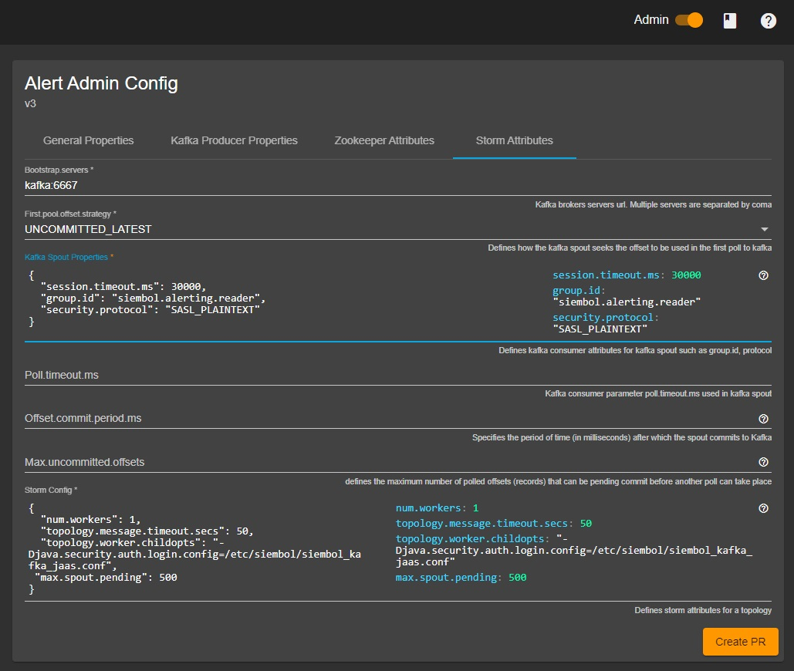

How to set up Kerberos for external dependencies
================================================

> **_Note:_** This document describes connecting to external dependencies that require Kerberos authentication. It does not contain information on how to set up Kerberos for a Storm Cluster. If that is required, please see the Storm documentation to enable Kerberos, https://storm.apache.org/releases/1.2.3/SECURITY.html, as this is out-of-scope of this document.

Enabling Kerberos for Kafka clients
-----------------------------------

Siembol services publish and consume data to and from Kafka. This Kafka communication can be secured with Kerberos by enabling the SASL_PLAINTEXT (or SASL_SSL) security protocol. 

Before adding the specific Kafka consumer and producer configuration you must ensure that the environment running the siembol storm topologies has a valid `krb5` config file. This should be configured appropriately with your organizations Kerberos setup and should be placed in at: `/etc/krb5.conf`. 

In most cases, this file should be a config map available in your Kubernetes namespace, and should be mounted into all siembol pods. Additionally, you will need to ensure the Storm workers have a keytab available to them that you wish to use for the Kafka authentication. We will assume that the keytab `/etc/security/keytabs/siembol.keytab` exists and allows ticket requests for the user `siembol@DOMAIN.NET`.

> **_Note:_**
If using the Docker images provided by this repositories build then the Docker images should have the appropriate Kerberos client libraries readily available. If not, you will need to ensure the libraries are installed. 

With a valid Kerberos config file and a user keytab with the correct access to the Kafka topics, we can now add the JAAS config used by Kafka clients. The JAAS file will also be created and made available to the Storm workers running the Kafka clients. Usually, this will be a config map file mount:

```java
KafkaClient {
   com.sun.security.auth.module.Krb5LoginModule required
   useKeyTab=true
   keyTab="/etc/security/keytabs/siembol.keytab"
   storeKey=true
   useTicketCache=false
   serviceName="kafka"
   principal="siembol@DOMAIN.NET";
};
```

We will assume that this file is mounted at the location `/etc/siembol/siembol_client_jaas.conf`. 

Next, siembol Storm topologies need to be instructed to use this JAAS configuration. This can be done through the [siembol admin UI](../../siembol_ui/siembol_ui.md) for a service. Navigate to `Admin -> Storm Attributes -> Storm Config` and add the following the JSON configuration: 

```
"topology.worker.childopts": "-Djava.security.auth.login.config=/etc/siembol/siembol_kafka_jaas.conf"
```



With the JAAS configuration, keytab and Kerberos configuration all in place, we can enable our Kafka clients to use Kerberos. For the Storm Kafka spout, we do this in the `Admin -> Storm attributes -> Kafka Spout Properties`.  For the Kafka Producer navigate to `Admin -> Kafka Producer Properties -> Kafka Producer Properties`. In both instances, set the security protocol as required: 

```properties
"security.protocol": "SASL_PLAINTEXT"
```

Topologies should now use Kerberos to communicate with Kafka. 

Zookeeper
---------

Siembol services use Zookeeper for state management. Similarly to Kafka, Kerberos can be enabled for communication with Zookeeper. To enable Kerberos we simply need to ensure a Zookeeper client entry is added to our JAAS configuration which we created when setting up Kerberos for Kafka. If you have not followed the Kafka section, please read the first few paragraphs of this how-to, and ensure that you have a valid `/etc/krb5.conf` file, a deployed keytab to `/etc/security/keytabs/siembol.keytab` and a JAAS file at `/etc/siembol/siembol_kafka_jaas.conf`.

The new entry should be as follows: 

```java
Client {
   com.sun.security.auth.module.Krb5LoginModule required
   useKeyTab=true
   keyTab="/etc/security/keytabs/siembol.keytab"
   storeKey=true
   useTicketCache=false
   serviceName="zookeeper"
   principal="siembol@UBERIT.NET";
};
```

Now, as long as topology.worker.childopts has been setup as follows (see Kafka setup), then it will use this configuration for authenticating to Zookeeper.

```java
topology.worker.childopts": "-Djava.security.auth.login.config=/etc/siembol/siembol_kafka_jaas.conf"
```

Storm API and Storm topology submission
---------------------------------------

The Siembol topology management service takes responsibility for the orchestration of storm topologies throughout their lifecycle. If you have enabled Kerberos for the Storm cluster then we will need to ensure that the topology manager service can kill topologies via a kerborised Storm API, as well as deploy a topology to a kerborised cluster. 

To enable Kerberos authentication for the topology manager service's HTTP client we should firstly ensure a valid `/etc/krb5.conf` and keytab have been mounted or provided into the environment in which the topology manager service is running. Commonly this will be a container running on Kubernetes. Please see enabling Kerberos in Kafka for further details on mounting a krb5.conf file and keytab. 

With our environment configured with the necessary resources we need to provide the `java.security.auth.login.config` configuration option to the topology manager service. If running as a Docker container, or in Kubernetes, provide the following environment variable:

```yaml
  env:
  - name: JAVA_OPTS
    value: -Djava.security.auth.login.config=/etc/siembol/siembol_jaas.conf
```

The JAAS configuration needs to contain the following:

```java
com.sun.security.jgss.krb5.initiate {
    com.sun.security.auth.module.Krb5LoginModule required
    useTicketCache=false 
    renewTicket=true 
    useKeyTab=true 
    keyTab="/etc/security/keytabs/siembol.keytab"
    principal="siembol@DOMAIN.NET";
};
```
Then enable Kerberos in the application.properties file for the storm-topology-manager service:

```java
topology-manager.storm.authentication-type=kerberos
```

To enable Kerberos for Zookeeper communication required by the storm topology management service, you will need to modify the JAAS configuration above and include the following:

```java
Client {
    com.sun.security.auth.module.Krb5LoginModule required 
    useTicketCache=false 
    renewTicket=true 
    useKeyTab=true 
    serviceName="zookeeper"
    keyTab="/etc/security/keytabs/siembol.keytab"
    principal="siembol@DOMAIN.NET";
};
```

To enable Kerberos for the Storm deployment we will override the default storm-submit YAML job embedded in the storm topology manager. This job definition assumes no security, and will work for unauthenticated management of a Storm cluster. For a Kerberos enabled storm cluster we will create a storm submit file with the required Kerberos configuration and mount it into the storm-topology-manager service. Create a custom storm-submit.yaml like the following: 

```yaml
apiVersion: batch/v1
kind: Job
metadata:
  name: --name--
  namespace: --namespace--
spec:
  template:
    metadata:
      labels:
        app: --name--
        name: storm-topology-manager
    spec:
      restartPolicy: Never
      containers:
        - image: --image--
          name: --name--
          env:
            - name: NIMBUS_SEEDS
              value: '--nimbus--'
            - name: STORM_CONF_DIR 
              value: /etc/storm
          args: --args--
          imagePullPolicy: IfNotPresent
          volumeMounts:
            - name: keytab
              mountPath: "/etc/security/keytabs/siembol.keytab"
              subPath: "siembol.keytab"
            - name: config
              mountPath: "/etc/siembol/siembol_jaas.conf"
              subPath: "siembol_jaas.conf"
            - name: krb5
              mountPath: "/etc/krb5.conf"
              subPath: "krb5.conf"
            - name: config
              mountPath: "/etc/storm/storm.yaml"
              subPath: "storm.yaml"
      volumes:
      - name: krb5
        configMap:
          name: krb5
      - name: config
        configMap:
          name: storm-topology-manager
      - name: keytab
        secret:
          secretName: siembol-keytab
```
The important resources to create your environment are:

- `siembol.keytab`
- `siembol_jaas.conf`
- `krb5.conf`
- `storm.yaml`

The JAAS configuration is as follows for Storm:

```java
StormClient {
    com.sun.security.auth.module.Krb5LoginModule required 
    useTicketCache=false 
    renewTicket=true 
    serviceName="nimbus"
    useKeyTab=true 
    keyTab="/etc/security/keytabs/siembol.keytab"
    principal="siembol@DOMAIN.NET";
};
```

Finally, create a `storm.yaml` file to tell the Storm client to use SASL:

```yaml
storm.thrift.transport: org.apache.storm.security.auth.kerberos.KerberosSaslTransportPlugin
java.security.auth.login.config: /etc/siembol/siembol_jaas.conf
```

The Job YAML definition described above can now be mounted into the Kubernetes container storm-topology-manager is running in. 

Provide the location in the `application.properties` file for the storm-topology-manager.  This will point to the YAML file created above which is now mounted in the storm-topology-container. The storm-topology-manager will now use this job spec when submitting.

```properties
topology-manager.k8s.storm-submit-job-template-file=storm-submit.yaml
```

The Storm topology manager should now authenticate to Storm and Zookeeper and submit new topologies using Kerberos.