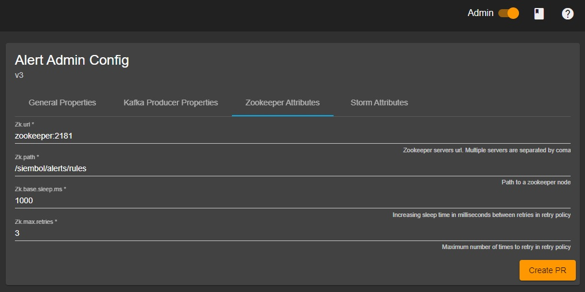

How to set-up ZooKeeper nodes for Siembol configuration
=======================================================

Siembol configurations are stored in git repositories and cached in ZooKeeper. ZooKeeper notifies the storm topologies when updates occur allowing for configuration changes without the need to restart components.

You can create the ZooKeeper nodes manually prior to running siembol services. However, you can use autocreation of ZooKeeper nodes by defining the default value of the node in the ZooKeeper connector property `init-value-if-not-exists`, for example:

```properties
config-editor.storm-topologies-zookeeper.zk-path=/siembol/synchronise
config-editor.storm-topologies-zookeeper.zk-url=siembol-zookeeper:2181
config-editor.storm-topologies-zookeeper.init-value-if-not-exists={}
```

Alternatively you can create a node by connecting to a ZooKeeper server and running a command like the following:

```shell
zookeeper@siembol-storm-zookeeper-0:/apache-zookeeper-3.5.5-bin$ bin/zkCli.sh
Connecting to localhost:2181
...
[zk: localhost:2181(CONNECTED) 3] create /siembol/node
```

To initialise it with any empty JSON object:

```shell
zookeeper@siembol-storm-zookeeper-0:/apache-zookeeper-3.5.5-bin$ bin/zkCli.sh
Connecting to localhost:2181
...
[zk: localhost:2181(CONNECTED) 3] set /siembol/node '{}'
```

 
ZooKeeper nodes for configuration deployments
---------------------------------------------

### Admin configuration settings

When siembol services are launched in Storm, they are given the ZooKeeper node to watch for configuration updates. If we take an alerting component as an example, we can navigate to the Admin interface in the siembol UI for the service and view ZooKeeper settings. 

`Siembol UI -> Alerts -> Admin -> ZooKeeper Attributes`



### Config editor rest application properties

The [config editor rest service](../../services/how-tos/how_to_set_up_service_in_config_editor_rest.md) needs to have the same ZooKeeper node mentioned above added into it's `application.properties`. This is added with the following entry: 

```properties
config-editor.services.alert.release-zookeeper.zk-path=/siembol/alerts/rules
```

These ZooKeeper nodes now ensure that any change to alerting rules in the Siembol UI will be deployed to alerting instances running in Storm. 

Zookeper nodes for storm topology manager
-----------------------------------------

The storm topology manager is responsible for the orchestration of Storm topologies Siembol requires. It does this by listening to a ZooKeeper synchronisation node, which the configuration rest service publishes a desired state to. The service will use an internal cache node to persists state, and continually try to reconcile any differences. 

Therefore, it is required to have two ZooKeeper nodes for this to work: at least one synchronization node and one cache node. The configuration rest service only requires access to write to the sync node, and it is set in the [configuration rest services](../../services/how-tos/how_to_set_up_service_in_config_editor_rest.md) `application.properties` file:

```properties
config-editor.storm-topologies-zookeeper.zk-path=/siembol/synchronise
```

The storm topology manager service requires read access to the synchronise node and read/write access to its internal cache node. Both nodes can be configured in the storm-topology-manager's `application.properties` file:

```properties
topology-manager.desired-state.zk-path=/siembol/synchronise
topology-manager.saved-state.zk-path=/siembol/cache
```
