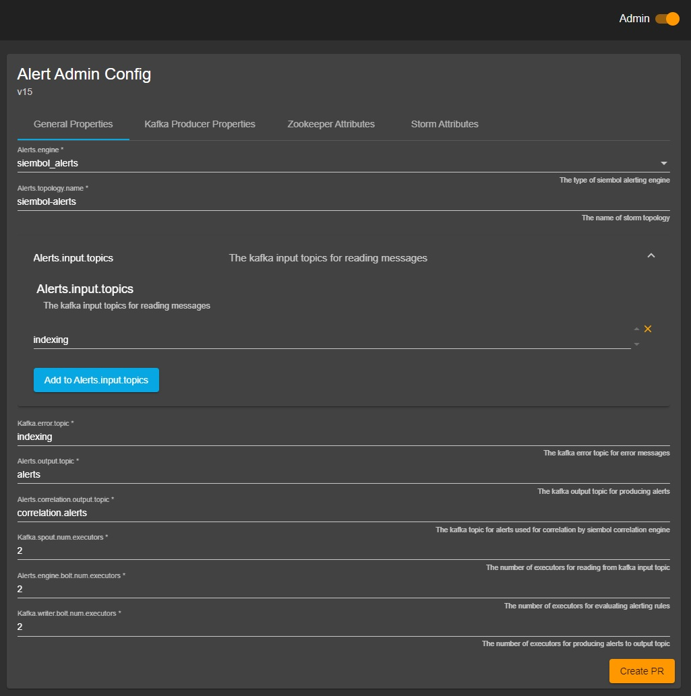
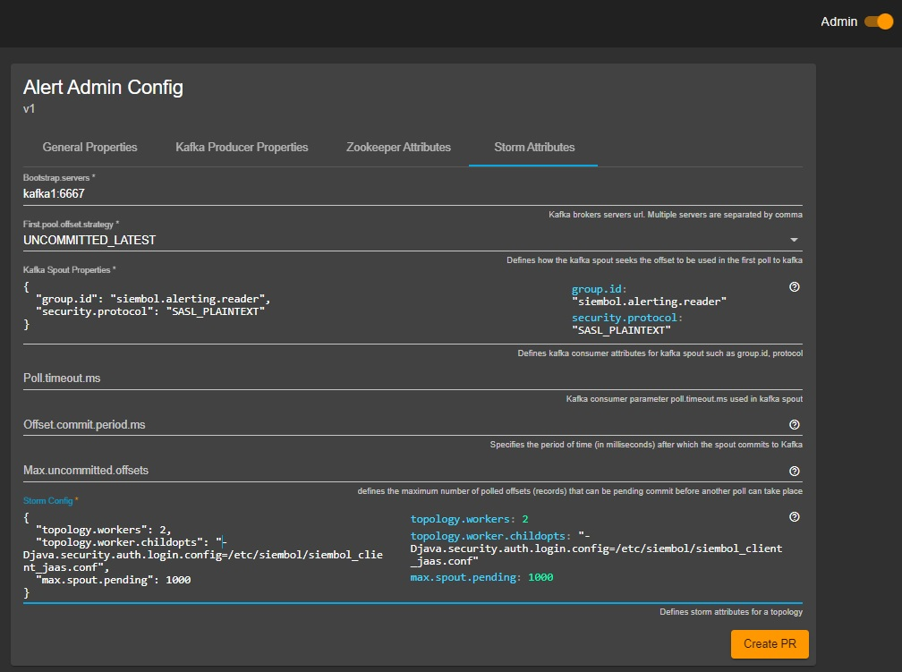

How to tune the performance of Storm topologies
===============================================

The siembol services comprise of one or more topologies running in Storm. In most cases, these services will require some performance tuning. Whilst this document will cover the common use-cases for performance-tuning, it will not be exhaustive. We highly recommend the reader familiarises themselves with the following excellent performance tuning guides about Storm and Kafka:

- https://storm.apache.org/releases/2.2.0/Concepts.html
- https://storm.apache.org/releases/current/Performance.html
- https://www.confluent.io/blog/how-choose-number-topics-partitions-kafka-cluster/

All settings mentioned below to tune parallelism are configurable in the [siembol admin UI](../../siembol_ui/siembol_ui.md).

Parallelism Concepts
--------------------

As volume of data increases, so will the parallelism requirements of Storm topologies that make up Siembol services. A significant amount of trial and error will be required to optimise performance, but some high level rules exist that can help guide. 

The default configuration for a Storm topology will most likely be one _worker_, one _spout_, one _processor_ and one _writer_. This is true for nearly all topologies running in Siembol. The Storm concepts link above gives a good overview of a topology, comprising one or more workers which execute tasks (logical threads of execution).

As a first principle, one should begin looking at increasing tasks (_spouts_, _processors_ and _writers_). It is useful to use the Storm UI and view the capacity values for bolts (_spouts_, _processors_, _writers_), where a value approaching 1 indicates that tuples are having to wait before entering bolts.  This is an indication that back pressure is occurring. A helpful visualization of these values also exists in the topology visualization section of the Storm UI. 

If you increase _spout_, _processor_ and _writers_ together, along with Kafka partitions you should see linear scalability of performance up until a point where the number of tasks in a single worker no longer yields linear improvement. At this point you should record the optimal maximum number of _spouts_, _processors_ and _writers_ of a worker in your environment. These should be the target size of _workers_, and you can scale _workers_ horizontally across Storm supervisor nodes. 

Storm Topology Configuration
----------------------------

It is generally optimal to set the Kafka spout parallelism equal to the number of partitions used in your Kafka topic. Increasing parallelism greater than the number of partitions will lead to idle spouts that do not process events. As partitions and spouts increase, so will the requirement for processing and writing tasks. Below is an example of how to increase spouts, processing and writing tasks using the [Siembol UI](../../siembol_ui/siembol_ui.md):



The fields to increase tasks in the alerting Storm topology are: 

```
Kafka.spout.num.executors
Alerts.engine.bolt.num.executors
Kafka.writer.bolt.num.executors
```

When the limit of a topology's horizontal scalability (i.e. the limit of a single worker's processing power through increasing tasks) is met, the next parallelism configuration option to adjust is the number of workers to run across one or more Storm supervisor hosts. This can be specified in the admin configuration of a siembol service: 



Increase the number of workers by changing `topology.workers`. 

The configuration of `topology.max.spout.pending` allows for the trade off between latency and throughput. If this value is set reasonably low (i.e. 500) you can expect low latency but slightly reduced throughput. If this is increased (i.e. 5000) you can expect greater throughput but lower latency.

Siembol topologies implement a configurable batch writer to further improve throughput. The internal batch size of topologies can be set through the UI by navigating to the `Admin Config -> Kafka Batch Writer Attributes`


The internal Kafka writer has a tick frequency of one second, which mean's if it has not filled it's batch it will flush and write to Kafka.