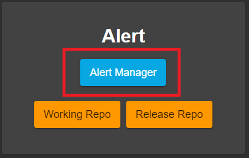

# Siembol Alert User Guide
## Overview
Siembol Alert is a detection engine used to filter matching events from an incoming data stream based on a configurable rule set. Rules can be built, modified, and tested through the Siembol UI.

Rules are JSON configs generated by the UI. The raw JSON can be viewed through the UI as necessary or can be seen in the store repo for Siembol Alert. 

## Accessing the UI
From the Siembol home page, click the alert manager button to load the alert manager interface



## Alert Manager UI
The Alert Manager UI is split into two sections. On the left-hand side you can see all the rules which are stored in Siembol Alert. On the right-hand side you can see all the rules which are deployed. Rules which are deployed still show up in the store section.


 [//]: # (TODO add image of store/deploy)

### Alert Rule Editor UI - Tabs
There are 3 different tabs in the Alert Rule Editor UI: 

- Edit config: allows you to edit the rule
- Test config: allows you to:
  - Provide a raw event to test your rule works as expected
  - Allows you to see the output from the event parsing through Siembol Alert
  - (n.b.) These tests are not persistent and just provide a point in time verification that the alert works for a specific alert
- Test cases: allows you to write persistent tests to verify the rule works

[//]: # (TODO show tabs alert rule editor UI)

### Alert Rule Editor UI - Edit Config
At the top there is a text input that allows you to provide a name for a rule.  Use a descriptive name to make it easier to identify later in the pipeline.

[//]: # (TODO add image for the config name)

There are 5 different tabs within the edit config UI:

1. [Rule Description](#rule-description)
2. [Source Type](#source-type)
3. [Matchers](#matchers)
4. [Tags](#tags)
5. [Rule Protection](#rule-protection)

#### Rule Description
This section contains a single text input that allows you set a description for the alert. This should be a short, helpful comment that allows anyone to identify the purpose of this alert.

[//]: # (TODO add image of rule description)

#### Source Type
This section allows you to determine the type of data you want to match on. It is essentially a matcher for the "source_type" field. This field does not support regex - however, using * as an input matches all source types.

The source_type field is set during parsing and is equal to the name of the parser config which was used to parse the event.

[//]: # (TODO add image of sourcetype)

```
Tip: if you want to match on multiple data sources, set the source type to be * and add a regex matcher (in the matcher section) to filter down to your desired source types.
```

#### Matchers
Matchers allow you to select the events you want the rule to alert on.

To add a matcher, click the 'Add to Matchers' button:

[//]: # (TODO add image of add to matchers button)

For guidance on how to use matchers, see the [General Guide](Siembol_General_Guide.md#matchers)

[//]: # (TODO add image of is_in_set matcher)

#### Tags
Tags are optional but recommended as they allow you categorise your rules.

To add a tag, click the "Add to Tags" button:

[//]: # (TODO add image of "add to tags button")

Each tag is a key-value pair. Both the key and the value inputs are completely freeform allowing you to tag your rules in the way which works best for your organisation.

You can use substitution in the value input to set the tag value equal to the value of a field from the event. The syntax for this is `{field_name}` eg:

[//]: # (TODO add image of substitution in tag value)

#### Rule Protection
Rule Protection allows you to prevent a noisy alert from flooding the components downstream. You can set the maximum number of times an alert can fire per hour and per day. If either limit is exceeded then any event that matches is filtered and not sent on to Siembol Response until the threshold is reset.

Rule Protection is optional.  If it is not configured for a rule, the rule will get the global defualts applied (global defaults are set during the deployment process - see below).

[//]: # (TODO add image of rule procetion page)

### Alert Rule Editor UI - Test Config
The use of the Test Config UI is covered in the [Test\_Config\_User\_Guide](#).

[//]: # (TODO add link to test config guide)

### Alert Rule Editor UI - Test Cases
The use of a test cases UI is covered in the [Test\_Cases\_User\_Guide](#).

[//]: # (TODO add link to test cases guide)

### Saving a config
You can save the config at any time (provided the config is valid) by clicking the submit button found in the edit config tab. This will commit it to the store.

[//]: # (TODO add image of the submit button)

## Deploying a config - Siembol Alert-specfic options
When you click the deploy button in the Alert Manager UI, you are presented with a box which allows you to set two things:

1. [Global Tags](#global_tags)
2. [Global Rule Protection](#global_rule_protection)

[//]: # (TODO add image of deploy options)

### Global Tags
You can add tags in the same way as you would for an individual rule. Clicking the "Add to Tags" button allows you to set the key and value fields for the rules. This tag is applied to all rules which are being deployed.

Adding global tags is optional.

[//]: # (TODO add image of global tags)

### Global Rule Protection
Setting the global rule protection limits is mandatory. These protections will apply to any rule which doesn't have rule protections configured already. See the [Rule Protection](#rule-protection) section above for more details.

Once both of these sections are complete, you can press "Validate" to ensure all of your rules are complete and free from syntax errors. Provided all validations pass, you can then press "Deploy" to create the pull request with the release repo.
