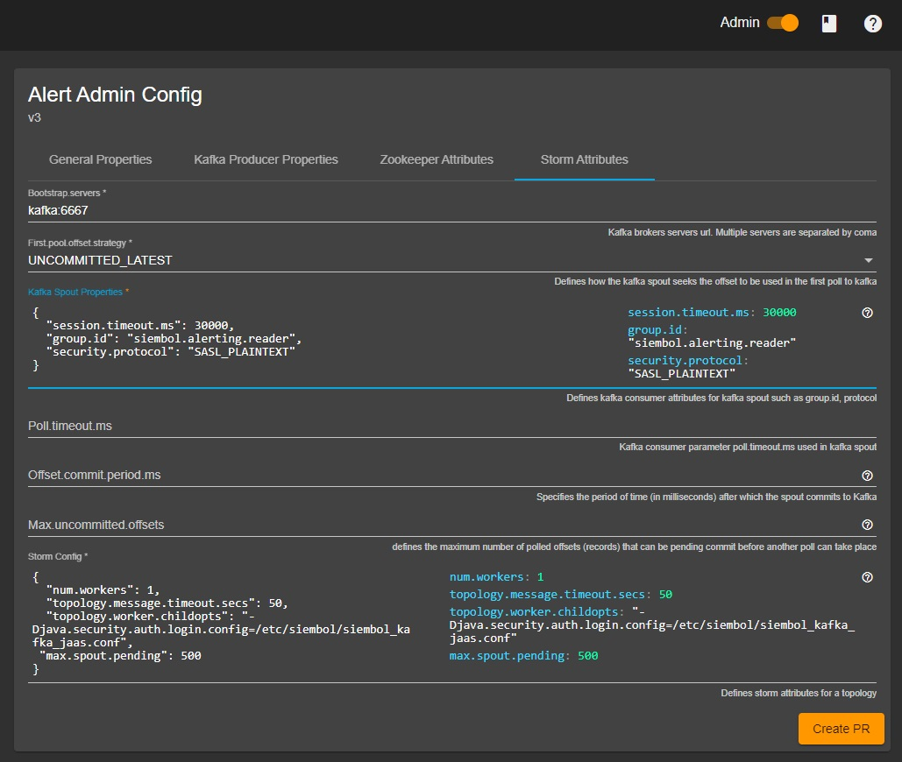

How to set up Kerberos for external dependencies
================================================

> **_Note:_** This document describes connecting to external dependencies that require Kerberos authentication. It does not contain information on how to set up Kerberos for a Storm Cluster. If that is required, please see the Storm documentation to enable Kerberos, https://storm.apache.org/releases/1.2.3/SECURITY.html, as this is out-of-scope of this document.

Enabling Kerberos for Kafka clients
-----------------------------------

Siembol services publish and consume data to and from Kafka. This Kafka communication can be secured with Kerberos by enabling the SASL_PLAINTEXT (or SASL_SSL) security protocol. 

Before adding the specific Kafka consumer and producer configuration you must ensure that the environment running the siembol storm topologies has a valid `krb5` config file. This should be configured appropriately with your organizations Kerberos setup and should be placed in at: `/etc/krb5.conf`. 

In most cases, this file should be a config map available in your Kubernetes namespace, and should be mounted into all siembol pods. Additionally, you will need to ensure the Storm workers have a keytab available to them that you wish to use for the Kafka authentication. We will assume that the keytab `/etc/security/keytabs/siembol.keytab` exists and allows ticket requests for the user `siembol@DOMAIN.NET`.

> **_Note:_**
If using the Docker images provided by this repositories build then the Docker images should have the appropriate Kerberos client libraries readily available. If not, you will need to ensure the libraries are installed. 

With a valid Kerberos config file and a user keytab with the correct access to the Kafka topics, we can now add the JAAS config used by Kafka clients. The JAAS file will also be created and made available to the Storm workers running the Kafka clients. Usually, this will be a config map file mount:

```java
KafkaClient {
   com.sun.security.auth.module.Krb5LoginModule required
   useKeyTab=true
   keyTab="/etc/security/keytabs/siembol.keytab"
   storeKey=true
   useTicketCache=false
   serviceName="kafka"
   principal="siembol@DOMAIN.NET";
};
```

We will assume that this file is mounted at the location `/etc/siembol/siembol_client_jaas.conf`. 

Next, siembol Storm topologies need to be instructed to use this JAAS configuration. This can be done through the [siembol admin UI](../../siembol_ui/siembol_ui.md) for a service. Navigate to `Admin -> Storm Attributes -> Storm Config` and add the following the JSON configuration: 

```
"topology.worker.childopts": "-Djava.security.auth.login.config=/etc/siembol/siembol_kafka_jaas.conf"
```



With the JAAS configuration, keytab and Kerberos configuration all in place, we can enable our Kafka clients to use Kerberos. For the Storm Kafka spout, we do this in the `Admin -> Storm attributes -> Kafka Spout Properties`.  For the Kafka Producer navigate to `Admin -> Kafka Producer Properties -> Kafka Producer Properties`. In both instances, set the security protocol as required: 

```properties
"security.protocol": "SASL_PLAINTEXT"
```

Topologies should now use Kerberos to communicate with Kafka. 
