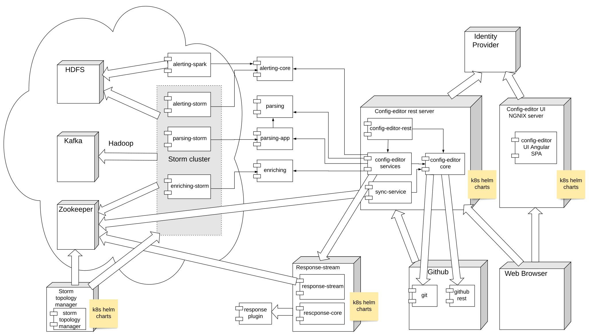

Introduction
=============

- [1. Siembol](siembol)
- [2. History](history)
- [3. How Siembol Improves upon Metron](#3-how-siembol-improves-upon-metron)
    * [3.1 Components for Alert Escalation](#31-components-for-alert-escalation)
    * [3.2 Integration with Other Systems – Siembol Response](#32-integration-with-other-systems–siembol-response)
    * [3.3 Advanced Parsing Framework for Building Fault-Tolerant Parsers](#33-advanced-parsing-framework-for-building-fault-tolerant-parsers)
    * [3.4 Advanced Enrichment Component](#34-advanced-enrichment-component)
    * [3.5 Configurations and Rules are Defined by a Web Application Siembol UI](#35-configurations-and-rules-are-defined-by-a-web-application-siembol-ui)
    * [3.6 Easy Installation to Try Out with Prepared Docker Images and Helm Charts](#36-easy-installation-to-try-out-with-prepared-docker-images-and-helm-charts)
- [4. Use Cases](#4-use-cases)
  * [4.1 SIEM Log Collection Using Open Source Technologies](#41-siem-log-collection-using-open-source-technologies)
  * [4.2 Detection Tool for Detection of Leaks and Attacks on Infrastructure](#42-detection-tool-for-detection-of-leaks-and-attacks-on-infrastructure)
- [5. High Level Architecture](#4-high-level-architecture)
  * [5.1 Data Pipelines](#51-data-pipelines)
  * [5.2 Services](#52-services)
  * [5.3 Infrastructure dependencies](#53-infrastructure-dependencies)
  * [5.4 Architecture](#54-architecture)

Siembol
--------

Siembol provides a scalable, advanced security analytics framework based on open-source big data technologies. Siembol normalizes, enriches, and alerts on data from various sources, allowing security teams to respond to attacks before they become incidents.

History
-------

Siembol was developed in-house at G-Research as a security data processing application, forming the core of the G-Research Security Data Platform. We knew that we needed a highly efficient, real-time event processing engine and used [Splunk](https://www.splunk.com/) and [Apache Metron](https://metron.apache.org/) in the early years of our experience. However, neither product attended to all of our needs -- we wanted specific features that mattered to G-Research.

As early adopters of Metron, we believed in the product and tried hard to adapt it to our needs. Ultimately, we recognized its limitations and we began to add the missing features and shore up its instabilities. Sadly, by the time we were able to give back to the Metron community, Metron's time had passed. However, as we still believe in the core mission of Metron, we are releasing our work under the project name, 'Siembol'. We hope this will provide the security community with an effective alternative, filling the void left by Metron's move to the [Apache Attic](https://attic.apache.org/).

How Siembol Improves upon Metron
--------------------------------

_Components for alert escalation._ CSIRT security teams can easily create a rule-based alert from a single data source, or they can create advanced correlation rules that combine various data sources. We are planning to release a tool for translating Sigma rule specification into the alerting rule engine soon after open-sourcing.

_Ability to integrate with other systems._ While the core functionality of Metron was great, we always yearned for more integration with the growing ecosystem of SIEM-related projects.  Currently, Siembol integrates with other systems such as [Jira](https://www.atlassian.com/software/jira), [TheHive](https://thehive-project.org/), [Cortex](https://github.com/TheHive-Project/Cortex), [ELK](https://www.elastic.co/what-is/elk-stack), and [LDAP](https://ldap.com/). Beyond that, Siembol’s plugin interface allows a custom integration with other systems used in incident response.

_Advanced parsing framework for building fault-tolerant parsers._ Metron gave us a great way to introduce a powerful parsing framework into our Security Data Platform but it was brittle and sensitive to even minor syntactic mistakes. Siembol provides a robust framework for normalizing and extracting fields from logs, supporting chaining of parsers, field extractors and transformation functions.

_Advanced enrichment component._ Siembol allows for defining rules for selecting enrichment logic, joining enrichment tables, and defining how to enrich the processed log with information from user-defined tables.

_Configurations and rules are defined by a modern Angular web application  -- Siembol UI -- and stored in Git repositories._ All configurations are stored in JSON format and edited by web forms in order to speed up the creation and learning time and avoid mistakes. Moreover, the Siembol UI supports validation, testing, and creating and evaluating test cases to mitigate configuration errors in a production environment.
 
_Supports OAUTH2/OIDC for authentication and authorization in the Siembol UI._ All Siembol services can have multiple instances with authorization based on OIDC group membership. This allows for multi-tenancy usage without the need to deploy multiple instances of Siembol.

_Easy installation for use with prepared Docker images and Helm charts._ Metron’s installation process was arduous and overwhelming; due to its flexible architecture, there were a multitude of ways to set up and configure Metron -- all of which could overwhelm a first-time user. While Siembol maintains the flexibility of Metron for advanced users, Siembol has simplified the installation process for those new to the project.

### Components for Alert Escalation

- Security teams can easily create a rule-based alert from a single data source, or they can create advanced correlation rules that combine various data sources.
- Siembol UI supports translating Sigma rule specification (generic and open signature format for SIEM alerting [https://github.com/SigmaHQ/sigma](https://github.com/SigmaHQ/sigma)) into the Siembol alerting rule.

### Integration with Other Systems – Siembol Response

- Easy way to integrate Siembol with other systems such as [Jira](https://www.atlassian.com/software/jira), [Cortex](https://github.com/TheHive-Project/Cortex), [ELK](https://www.elastic.co/what-is/elk-stack), and [LDAP](https://ldap.com/).
- Functionality to provide additional enrichments about an alert, such as [ELK](https://www.elastic.co/what-is/elk-stack) searches or [LDAP](https://ldap.com/) searches, with the option to filter the alert as part of an automatic incident response.
- Plugin interface allowing for custom integration with other systems used in incident response.
- We are planning to publish a collection of plugins that we are using internally at G-Research, while providing space for collecting plugins from the Siembol community.

### Advanced Parsing Framework for Building Fault-Tolerant Parsers

- Custom-built framework for normalizing logs (parsing) including chaining of extractors and transformations which allows the user to:
   - extract JSON, CSV structures, key value pairs, timestamps.
   - parse timestamps using standard formatters to an epoch form.
   - transform messages by renaming fields, filtering fields, or even the option to filter the whole message.
- Supporting use cases for advanced log ingestion using multiple parsers and a routing logic.
- Supporting a generic text parser, syslog, BSD syslog, and NetFlow v9 binary parser.

### Advanced Enrichment Component

- Defining rules for selecting enrichment logic, joining enrichment tables, and defining how to enrich the processed log.

### Configurations and Rules are Defined by a Web Application Siembol UI

- All configurations are stored in JSON format and edited by web forms in order to avoid mistakes and speed up creation and learning time.
- Configurations are stored in Git repositories.
- Supporting high integrity use cases with protected GitHub main branches for deploying configurations.
- Supporting validation and testing configurations. Moreover, Siembol UI supports creating and evaluating test cases.
- Configuration errors for a rule will only affect that specific rule; errors will no longer bring down the entire apparatus, an improvement over Metron.
- Siembol prefers a declarative JSON language rather than a scripting language like [Stellar](https://metron.apache.org/current-book/metron-stellar/stellar-common/index.html). We consider declarative language with testing and validation to be less error prone and simpler to understand.
- Supporting OAUTH2/OIDC for authentication and authorization in Siembol UI.
- All Siembol services can have multiple instances with authorization based on OIDC group membership. This allows multi-tenancy usage without the need to deploy multiple instances of Siembol.
- We are planning to test and tune OAUTH/OIDC integration with popular identity providers.

### Easy Installation to Try Out with Prepared Docker Images and Helm Charts

- Siembol supports deployment on external [Hadoop](https://hadoop.apache.org/) clusters to ensure high performance. However, we are providing k8s Helm charts for all deployment dependencies in order to test Siembol in development environments.

Use-Cases
---------

### SIEM Log Collection Using Open Source Technologies

- Siembol can be used to centralize both security data collecting and the monitoring of logs from different sources. In the process of collecting and inspecting logs from third party tools, the format of these logs can vary. Therefore, it is important for Siembol to support the normalization of logs into a standardized format with common fields, such as timestamp. It is often useful to enrich a log with metadata provided by CMDB or other internal systems which are important for building detections. 

- For example, data repositories can be enriched by data classification, network devices by a network zone, username by active directory group, etc. By using Siembol alerting services, CSIRT teams can use the tool to add detection on top of normalized logs. Alerts triggered from the detections are integrated into incident response and defined and evaluated by the Siembol response service. This allows for integration of Siembol with systems such as [Jira](https://www.atlassian.com/software/jira), [Hive](https://thehive-project.org/), or [Cortex](https://github.com/TheHive-Project/Cortex), and provides additional enrichments by searching ELK or doing LDAP queries. 

- At G-Research we use Siembol to parse, normalize, enrich and detect approximately 150k events a second. Per day, this adds up to volumes of approximately 15TB of raw data, or 13 billion events.

### Detection Tool for Detection of Leaks and Attacks on Infrastructure

- Siembol can be used as a tool for detecting attacks or leaks by teams responsible for the system platform. For example, the Big Data team at G-Research is using Siembol to detect leaks and attacks on the [Hadoop](https://hadoop.apache.org/) platform. These detections are then used as another data source within the Siembol SIEM log collection for the CSIRT team handling these incidents.

High Level Architecture
-----------------------

### Data Pipelines

### Services

- Parsing - normalizing logs in messages with one layer of key/value pairs.
- Enrichment - adding useful data to events to assist in detection and investigations.
- Alerting - filtering matching events from an incoming data stream of events based on a configurable rule set. The correlation alerting allows users to group several detections together before raising an alert.
- Response - flexible incident response workflows can be built and triggered in real-time via the highly modular and pluggable framework.

### Infrastructure dependencies

- [Kafka](https://kafka.apache.org/) - message broker for data pipelines.
- [Storm](https://storm.apache.org/) - stream processing framework for services except Siembol response integrated in Kafka streaming.
- [GitHub](https://github.com/) - store of service configurations used in Siembol UI.
- [ZooKeeper](https://zookeeper.apache.org/) - synchronization cache for updating service configurations from Git to services.
- [Kubernetes](https://kubernetes.io/) cluster - environment to deploy Siembol UI and related microservices for management and orchestration of Siembol services configurations.
- Identity provider - identity provider (OAUTH2/OIDC) used for Siembol UI, allowing for OIDC groups in managing authorization to services.

### Architecture

