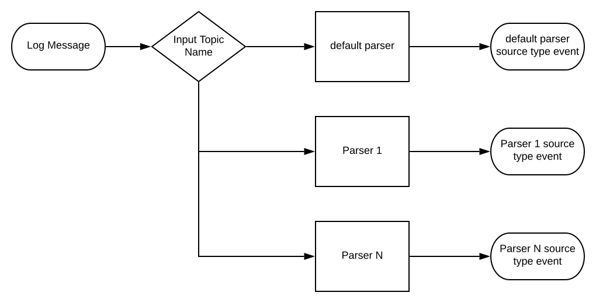
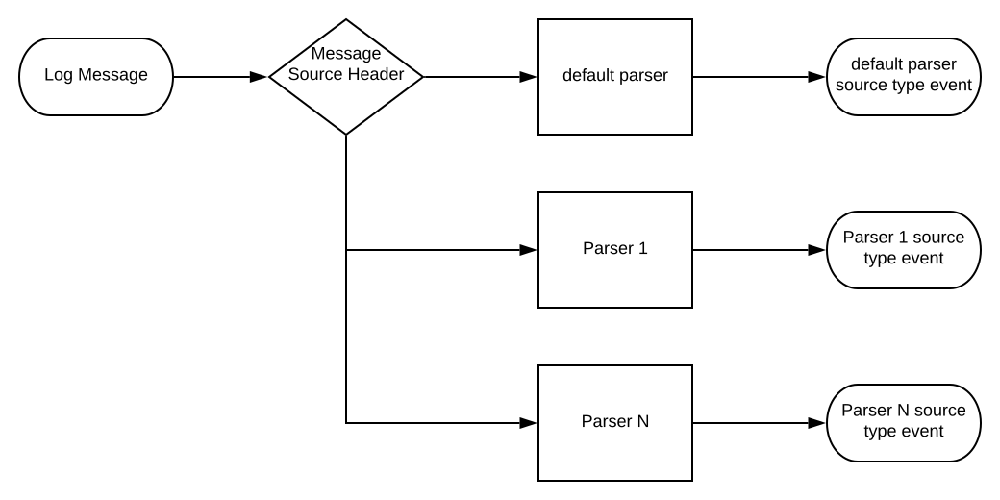

# Siembol Parsing Services

- [1. Overview](#overview)
  * [1.1 Key concepts](#key-concepts)
  * [1.2 Common fields](#common-fields)
- [2. Parser config](#parser-config)
  * [2.1 Parser Attributes](#parser-attributes)
  * [2.2 Parser Extractors](#parser-extractors)
      * [2.2.1 Overview](#overview-1)
      * [2.2.2 Common extractor attributes](#common-extractor-attributes)
      * [2.2.3 Pattern extractor](#pattern-extractor)
      * [2.2.4 Key value Extractor](#key-value-extractor)
      * [2.2.5 CSV Extractor](#csv-extractor)
      * [2.2.6 Json Extractor](#json-extractor)
      * [2.2.7 Json Path Extractor](#json-path-extractor)
  * [2.3 Parser Transformations](#parser-transformations)
      * [2.3.1 Overview](#overview-2)
      * [2.3.2 Common fields](#common-fields-1)
- [3. Parsing application](#parsing-application)
  * [3.1 Overview](#overview-3)
  * [3.2 Single Parser](#single-parser)
  * [3.3 Router parsing](#router-parsing)
  * [3.4 Topic routing parsing](#topic-routing-parsing)
  * [3.5 Header routing parsing](#header-routing-parsing)
- [4. Admin config](#admin-config)

## Overview
Siembol provides parsing services for normalising logs into messages with one layer of key/value pairs. Clean normalised data is very important for further processing such as alerting.
### Key concepts
- `Parser` is a siembol configuration that defines how to normalise a log 
- `Parsing app` is a stream application (storm topology) that combines one or multiple parsers, reads logs from kafka topics and produces normalised logs to output kafka topics
### Common fields
These common fields are included in all siembol messages after parsing:
- `original_string` - The original log before normalisation
- `timestamp` - Timestamp extracted from the log in milliseconds since the UNIX epoch
- `source_type` - Data source - the siembol parser that was used for parsing the log 
- `guid` - Unique identification of the message
## Parser config
The configuration defines how the log is normalised
- `parser_name` - Name of the parser
- `parser_version` - Version of the parser
- `parser_author` - Author of the parser
- `parser_description`- Description of the parser
### Parser Attributes
- `parser_type` - The type of the parser
    - Netflow v9 parser - parses a netflow payload and produces a list of normalised messages. Netflow v9 parsing is based on templates and the parser is learning templates while parsing messages.
    - Generic parser - Creates two fields
        - `original_string` - The log copied from the input
        - `timestamp` - Current epoch time of parsing in milliseconds. This timestamp can be overwritten in further parsing
    - Syslog Parser
        - `syslog_version` - Expected version of the syslog message - `RFC_3164`, `RFC_5424`, `RFC_3164, RFC_5424`
        - `merge_sd_elements` - Merge SD elements of the syslog message into one parsed object
        - `time_formats` - Time formats used for time formatting. Syslog default time formats are used if not provided 
        - `timezone` - Time zone used in syslog default time formats
### Parser Extractors
Extractors are used for further extracting and normalising parts of the message. 

#### Overview
An extractor reads an input field and produces the set of key value pairs extracted from the field. Each extractor is called in the chain and its produced messages are merged into the parsed message after finishing the extraction. This way the next extractor in the chain can use the outputs of the previous ones. If the input field of the extractor is not part of the parsed message then its execution is skipped and the next one in the chain is called. A preprocessing function of the extractor is called before the extraction in order to normalise and clean the input field. Post-processing functions are called on extractor outputs in order to normalise its output messages.
#### Common extractor attributes
- `is_enabled` - The extractor is enabled
- `description` - The description of the extractor
- `name` - The name of the extractor
- `field` - The field on which the extractor is applied
- `pre_processing_function` - The pre-processing function applied before the extraction
    - `string_replace` - Replace the first occurrence of `string_replace_target` by `string_replace_replacement` 
    - `string_replace_all` - Replace all occurrences of `string_replace_target` by `string_replace_replacement`. You can use a regular expression in `string_replace_target`
- `post_processing_functions` - The list of post-processing functions applied after the extractor
    - `convert_unix_timestamp` - Convert `timestamp_field` in unix epoch timestamp in seconds to milliseconds 
    - `format_timestamp` - Convert `timestamp_field` using `time_formats` 
        - `validation_regex` - validation regular expression for checking format of the timestamp, if there is no match the next formatter from the list is tried
        - `time_format` using syntax from [https://docs.oracle.com/javase/8/docs/api/java/time/format/DateTimeFormatter.html](https://docs.oracle.com/javase/8/docs/api/java/time/format/DateTimeFormatter.html)
        - `timezone` - Time zone used by the time formatter
    - `convert_to_string` - Convert all extracted fields as strings except fields from the list `conversion_exclusions`
- `extractor_type` - The extractor type - one from `pattern_extractor`, `key_value_extractor`, `csv_extractor`, `json_extractor` 
- flags
    - `should_overwrite_fields` - Extractor should overwrite an existing field with the same name, otherwise it creates a new field with the prefix `duplicate`
    - `should_remove_field` - Extractor should remove input field after extraction
    - `remove_quotes` - Extractor removes quotes in the extracted values
    - `skip_empty_values` - Extractor will remove empty strings after the extraction
    - `thrown_exception_on_error`- Extractor throws an exception on error (recommended for testing), otherwise it skips the further processing
#### Pattern extractor
Extracting key value pairs by matching a list of regular expressions with named-capturing groups, where names of the groups are used for naming fields. Siembol supports syntax from [https://docs.oracle.com/javase/8/docs/api/java/util/regex/Pattern.html](https://docs.oracle.com/javase/8/docs/api/java/util/regex/Pattern.html) except allowing to use underscores in the names of captured groups
- `regular_expressions` - The list of regular expressions 
- `dot_all_regex_flag` - The regular expression `.` matches any character - including a line terminator
- `should_match_pattern` - At least one pattern should match otherwise the extractor throws an exception
#### Key value Extractor
Key value extractor extracts values from the field which has the form `key1=value1 ... keyN=valueN`
 - `word_delimiter`- Word delimiter used for splitting words, by default ` `
 - `key_value_delimiter`- Key-value delimiter used for splitting key value pairs, by default `=`;
 - `escaped_character`- Character for escaping quotes, delimiters, brackets, by default `\\`;
 - `quota_value_handling` - Handling quotes during parsing
 - `next_key_strategy` - Strategy for key value extraction where key-value delimiter is found first and then the word delimiter is searched backward
 - `escaping_handling` - Handling escaping during parsing
#### CSV extractor
- `column_names` - Specification for selecting column names, where `skipping_column_name` is a name that can be used to not include a column with this name in the parsed message
- `word_delimiter` - Word delimiter used for splitting words 
#### Json Extractor
Json extractor extracts valid json message and unfolds json into flat json key value pairs.
- `path_prefix` - The prefix added to the extracted field names after json parsing
- `nested_separator` - The separator added during unfolding of nested json objects
#### Json Path Extractor
Json Path extractor evaluates json path queries on the input field and stores their results. Siembol supports `dot` and `bracket` notation using syntax from [https://github.com/json-path/JsonPath#readme](https://github.com/json-path/JsonPath#readme) 
- `at_least_one_query_result` - At least one query should store its result otherwise the extractor throws an exception
- `json_path_queries` - List of json path queries, where a json path `query` is evaluated and stored in `output_field` on success
### Parser Transformations
#### Overview
All key value pairs generated by parsers and extractors can be modified by a chain of transformations. This stage allows the parser to clean data by renaming fields, removing fields or even filtering the whole message. 
#### Common fields
Common transformation fields:
- `is_enabled` - The transformation is enabled
- `description` - The description of the transformation

#### field name string replace
Replace the first occurrence of `string_replace_target` in field names by `string_replace_replacement`

#### field name string replace all
Replace all occurrences of `string_replace_target` by `string_replace_replacement`. You can use a regular expression in `string_replace_target`
#### field name string delete all
Delete all occurrences of `string_replace_target`. You can use a regular expression in `string_replace_target`
#### field name change case
Change case in all field names to `case_type`
#### rename fields
Rename fields according to mapping in `field_rename_map`, where you specify pairs of `field_to_rename`, `new_name`
#### delete fields
Delete fields according to the filter in `fields_filter`, where you specify the lists of patterns for `including_fields`, `excluding_fields`
#### trim value
Trim values in the fields according to the filter in `fields_filter`, where you specify the lists of patterns for `including_fields`, `excluding_fields`
#### lowercase value
Lowercase values in the fields according to the filter in `fields_filter`, where you specify the lists of patterns for `including_fields`, `excluding_fields`
#### uppercase value
Uppercase values in the fields according to the filter in `fields_filter`, where you specify the lists of patterns for `including_fields`, `excluding_fields`
#### chomp value
Remove new line ending from values in the fields according to the filter in `fields_filter`, where you specify the lists of patterns for `including_fields`, `excluding_fields`
#### filter message
Filter logs that are matching the `message_filter`, where `matchers` are specified for filtering.
## Parsing application
### Overview
Parsers are integrated in a stream application (storm topology) that combines one or multiple parsers, reads a log from input kafka topics and produces a normalised log to output kafka topics when parsing is successful or to an error topic on error.
- `parsing_app_name` - The name of the parsing application
- `parsing_app_version` - The version of the parsing application
- `parsing_app_author` - The author of the parsing application
- `parsing_app_description`- Description of the parsing application 
- `parsing_app_settings` - Parsing application settings
    - `parsing_app_type`- The type of the parsing application - `single_parser`, `router_parsing`, `topic_routing_parsing` or `header_routing_parsing`
    - `input_topics` - The kafka topics for reading messages for parsing
    - `error_topic`- The kafka topic for publishing error messages
    - `num_workers` - The number of workers for the parsing application
    - `input_parallelism` - The number of parallel executors per worker for reading messages from the input kafka topics
    - `parsing_parallelism` - The number of parallel executors per worker for parsing messages
    - `output_parallelism` - The number of parallel executors per worker for publishing parsed messages to kafka
    - `parse_metadata` - Parsing json metadata from input key records using `metadata_prefix` added to metadata field names, by default `metadata_`
    - `max_num_fields` - Maximum number of fields after parsing the message
    - `max_field_size` - Maximum field size after parsing the message in bytes
    - `original_string_topic` - Kafka topic for messages with truncated original_string field. The raw input log for a message with truncated `original_string` will be sent to this topic
- `parsing_settings` - Parsing settings depends on parsing application type
### Single Parser
The application integrates a single parser.
- `parser_name` - The name of the parser from parser configurations
- `output_topic`- The kafka topic for publishing parsed messages
### Router parsing

The application integrates multiple parsers. First, the router parser parses the input message, from its output the routing field is extracted and used to select the next parser from the list of parsers by using pattern matching. The parsers are evaluated in order and only one is selected per log. 
- `router_parser_name` - The name of the parser that will be used for routing
- `routing_field` - The field of the message parsed by the router that will be used for selecting the next parser
- `routing_message` - The field of the message parsed by the router that will be routed to the next parser
- `merged_fields` - The fields from the message parsed by the router that will be merged to a message parsed by the next parser
- `default_parser` - The parser that should be used if no other parsers is selected with `parser_name` and `output_topic`
- `parsers` - The list of parsers for further parsing
    - `routing_field_pattern` - The pattern for selecting the parser
    - `parser_properties` - The properties of the selected parser with `parser_name` and `output_topic`
### Topic routing parsing

The application integrates multiple parsers and reads logs from multiple topics. The parser is selected based on the topic name on which the log was received.
- `default_parser` - The parser that should be used if no other parser is selected with `parser_name` and `output_topic`
- `parsers` - The list of parsers for further parsing
    - `topic_name` - The name of the topic for selecting the parser
    - `parser_properties` - The properties of the selected parser with `parser_name` and `output_topic`
### Header routing parsing

The application integrates multiple parsers and uses a kafka message header for routing. The parser is selected based on the dedicated header value.
- `default_parser` - The parser that should be used if no other parser is selected with `parser_name` and `output_topic`
- `header_name` - The name of the header used for routing
- `parsers` - The list of parsers for further parsing
    - `source_header_value` - The value in the header for selecting the parser
    - `parser_properties` - The properties of the selected parser with `parser_name` and `output_topic`        
## Admin Config
- `topology.name.prefix` - The prefix that will be used to create a topology name using the application name, by default `parsing`
- `client.id.prefix` - The prefix that will be used to create a kafka producer client id using the application name
- `group.id.prefix`- The prefix that will be used to create a kafka group id reader using the application name
- `zookeeper.attributes` - Zookeeper attributes for updating parser configurations 
    - `zk.url` - Zookeeper servers url. Multiple servers are separated by a comma
    - `zk.path` - Path to a zookeeper node
- `kafka.batch.writer.attributes` - Global settings for the kafka batch writer used if they are not overridden
    - `producer.properties` - Defines kafka producer properties, see [https://kafka.apache.org/0102/documentation.html#producerconfigs](https://kafka.apache.org/0102/documentation.html#producerconfigs)
- `storm.attributes` - Global settings for storm attributes used if they are not overridden
    - `bootstrap.servers` - Kafka brokers servers url. Multiple servers are separated by a comma
    - `first.pool.offset.strategy` - Defines how the kafka spout seeks the offset to be used in the first poll to kafka
    - `kafka.spout.properties` - Defines the kafka consumer attributes for the kafka spout such as group.id, protocol, see [https://kafka.apache.org/0102/documentation.html#consumerconfigs](https://kafka.apache.org/0102/documentation.html#consumerconfigs)
    - `poll.timeout.ms`- Kafka consumer parameter `poll.timeout.ms` used in the kafka spout
    - `offset.commit.period.ms` - Specifies the period of time (in milliseconds) after which the spout commits to Kafka, see [https://docs.cloudera.com/HDPDocuments/HDP3/HDP-3.1.5/storm-moving-data/content/tuning_kafkaspout_performance.html](https://docs.cloudera.com/HDPDocuments/HDP3/HDP-3.1.5/storm-moving-data/content/tuning_kafkaspout_performance.html)
    - `max.uncommitted.offsets`- Defines the maximum number of polled offsets (records) that can be pending commit before another poll can take place
    - `storm.config` - Defines storm attributes for a topology, see [https://storm.apache.org/releases/current/Configuration.html](https://storm.apache.org/releases/current/Configuration.html)
- `overridden_applications`- List of overridden settings for individual parsing applications. The overridden application is selected by `application.name`, `kafka.batch.writer.attributes` and `storm.attributes`
