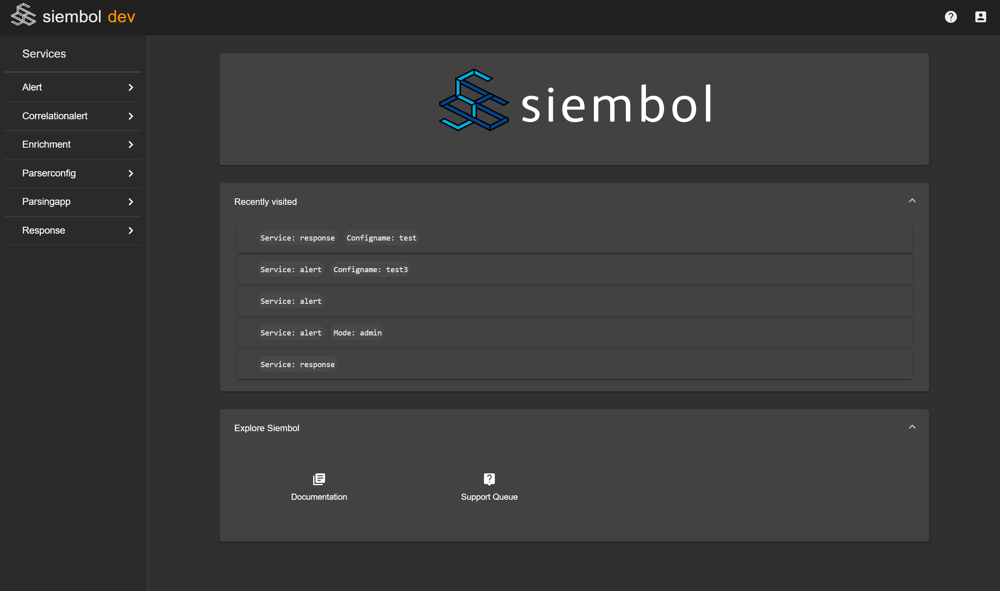

# How to add links to siembol ui home page
The siembol home page has an 'Explore Siembol' section at the button of its home page as can be seen in the screenshot below. It is used for quick access to useful resources such as documentation, ticket tracking systems etc... By default there is a link to the documentation and to the issues page on the git repo.

New links can be added from the `ui-config.json` config file. 
Below is the default config file provided where the two default links are in "homeLinks". 

        {
            "environment": "demo",
            "serviceRoot": "https://config-editor/",
            "uiBootstrapPath": "./ui-bootstrap.json",
            "authType": "disabled",
            "homeLinks": [
                {
                    "icon": "library_books",
                    "title": "Documentation",
                    "link": "https://github.com/G-Research/siembol/tree/master/docs"
                },
                {   
                    "icon": "live_help",
                    "title": "Issues",
                    "link":  "https://github.com/G-Research/siembol/issues"}
                ]
        }

To add a new one you need three things:
- the url where the user will be redirected to on click
- the icon to be displayed: this has to be the name of a material icon (you can find them all here: https://material.io/)
- the title displayed below the icon 
