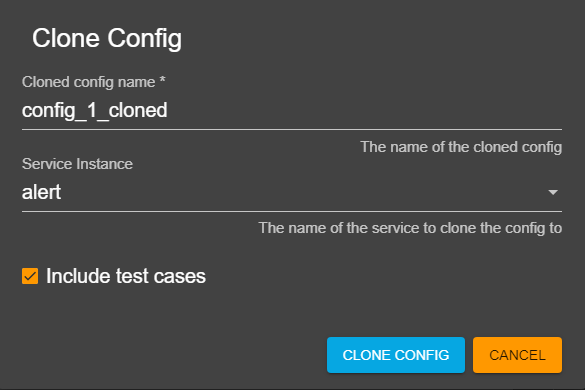

# How to add new config in Siembol UI

Adding a new config is done through the config manager view as seen below.

## Add/Clone/Paste new config
There are three ways to create a new config:
- by clicking on the `plus` icon on the right of the search bar
- by cloning another config using the clone button in the `Store Actions` column
- by pasting another config from your clipboard by clicking on the paste icon on the right of the search bar

You will then be redirected to the Config Editor. The config name has to be unique and cannot contain any spaces. 

### Cloning
When cloning a config a dialog will open up as seen in screenshot below. The following fields can be filled in:
- cloned config name: the name the new config will have
- service instance: the service instance of the same type the config will be cloned to, the default value is the current service
- include test cases: whether test cases should be cloned as well

After clicking "clone config" you will be redirected to the new config.

## Validate and Submit config to Store
Once all required fields (indicated with a `*`) are filled in the `Submit` button at the bottom right becomes clickable. Clicking it will run a validation check on the config and if it is successful a dialog will open where you can confirm the submission (see screenshot below). If the validation is not successful an error dialog will pop up. 

