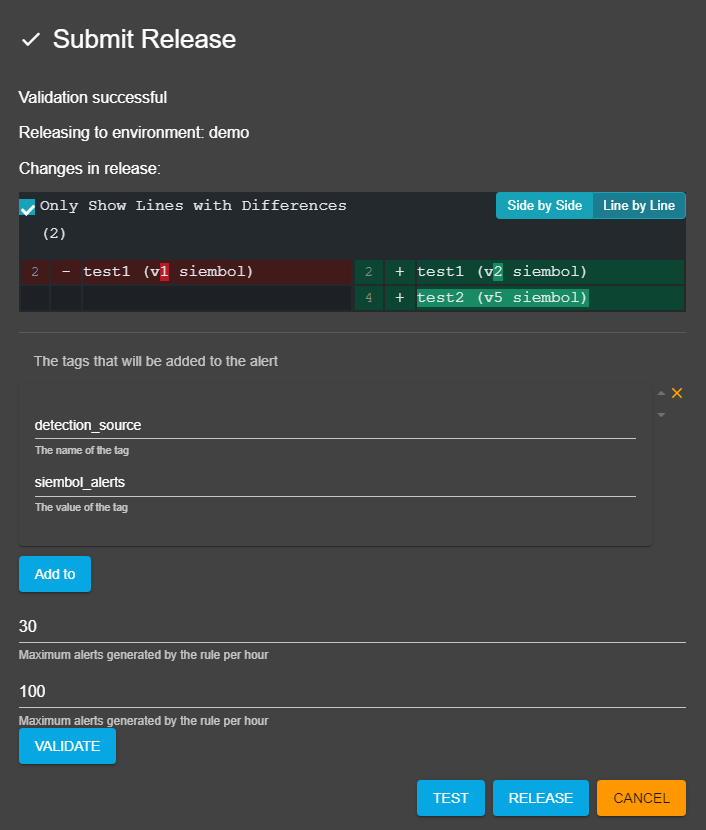
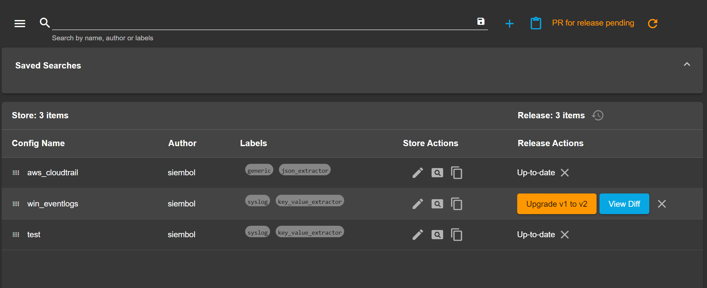

# How to release configurations in Siembol IO

## Editing Release
To upgrade a config in release to the latest version in store click on the `Upgrade x to y` button in the `Release Actions` column. It is only visible when a config in release is not up-to-date with the store. You can also click on `View Diff` to see the changes made.

To remove a config from release simply click on the cross icon in the `Release Actions` column. 

To change the order of the configs in release simply drag the release config to its desired location (it is only possible to reorder configs in release when no search or filter is applied).

> **_Note:_** A config can only be upgraded not downgraded.

## Release config not in current release
To release a config that is not released, click the `Add to Release` button in the `Release Actions` column.

## Create Pull Request with new release in Siembol UI

Once configs have been added/deleted/upgraded/reordered use the `Release PR` button above which is enabled after changes to release. This will open up a dialog, for some services it will automatically run a validation in the background, for others (e.g: alert, correlationalert) additional metadata can be specified in the dialog before clicking the `Validate` button (see in screenshot above). Once validated the changes to the release are displayed in the dialog.  

For some services it will be possible to run tests on the all the configs in the service by clicking the `Test` button in the dialog. 

To create a pull request in the release repo of the service being edited click on the `Deploy` button in the dialog.

If the user trying to release does not have the latest version of the release, an error dialog will be shown and the latest release will be loaded from the backend. The user will have to redo its release changes to try again.

Once a pull request has been created in the repo it is not possible to create another one until it is either merged or closed. You can see when a pull request is opened in the UI, the `Release PR` button is replaced with `PR for release pending` and a `reload` icon (see screenshot below). By clicking on the first a new tab is open to the pull request. The second should be clicked once the pull request is merged/close to reload the config from the backend and be able to release again.

