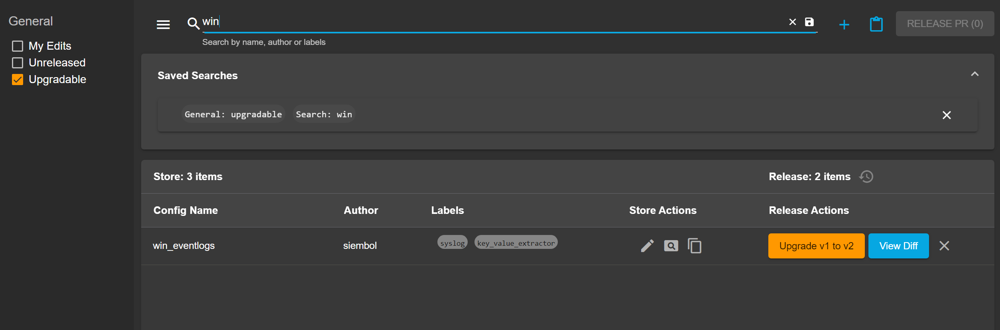

# How to filter configs and save searches
On the config manager page there are multiple ways to filter configs. Searches can also be saved by a user or shared among users through the URL.

## Search bar
The search bar can be used to filter for: author, name and labels of configs. The words in the search will all be checked against the configs.

> **_Example:_** if the user searches for `TomH windows` only the configs with both `tomh` and `windows` in either author, name or labels will be displayed.

To save a search click on the `save` icon to the right of the search bar. It will then be displayed in the saved search's panel below that can be expanded. Click on a saved search to apply it. 

## Checkboxes
On the left-hand side of the config manager page is a column for checkboxes. The standard checkboxes for each service are:
- `my configs` - configs last modified by current user
- `upgradable` - configs with unreleased changes in store
- `unreleased` - unreleased configs

To add more custom checkboxes to a service see [here](./how_to_use_ui_bootstrap_file.md).

