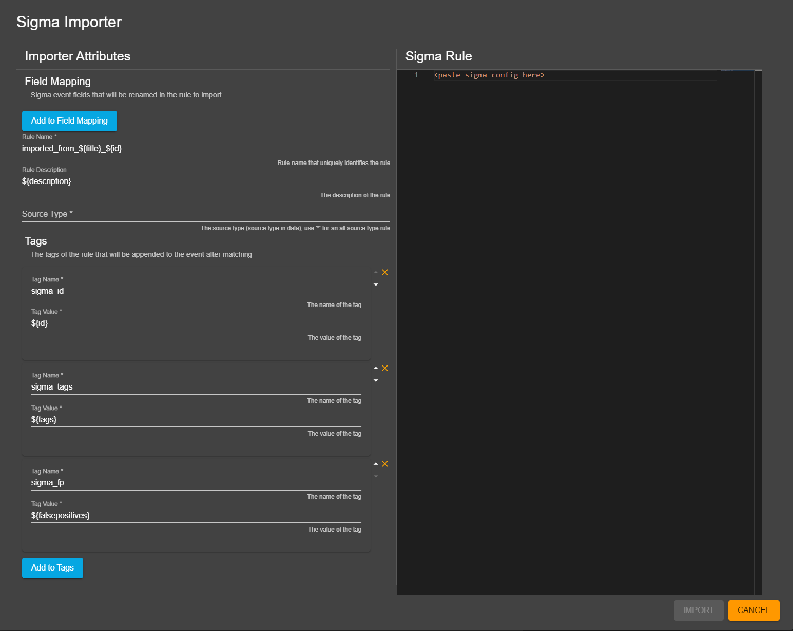
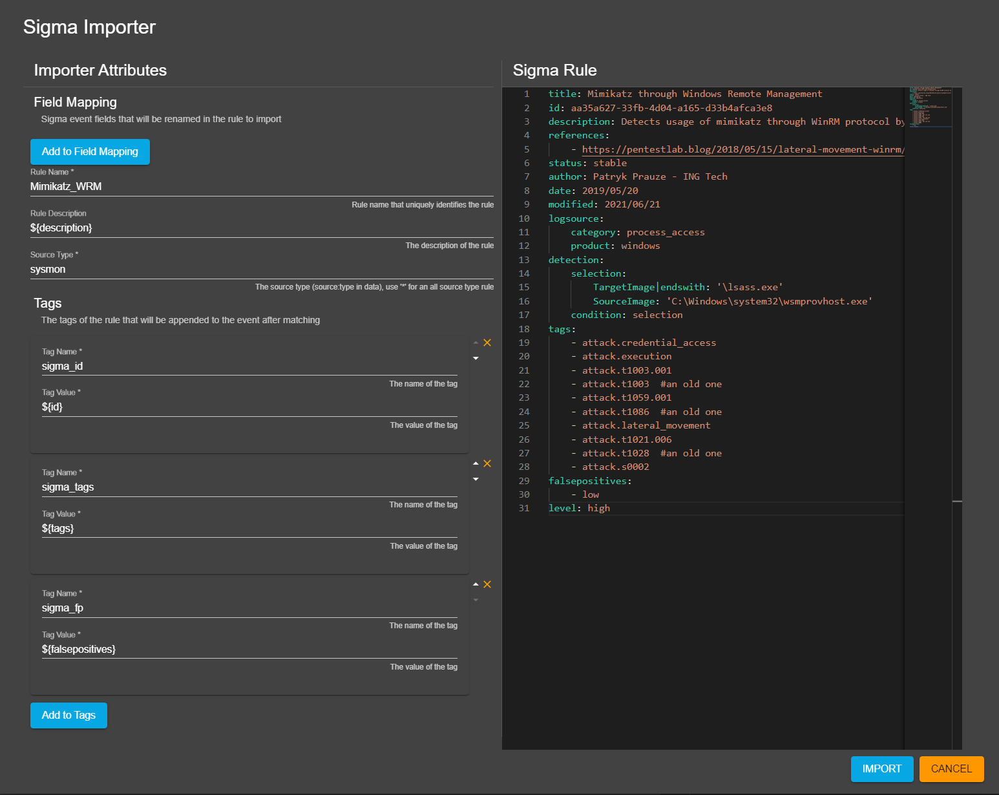

# How to import a sigma rule
It is possible to convert sigma rules into siembol alerting rules.

To do you need to click on the `import` icon in the config manager on the right of the search bar (see screenshot below).

This will open a dialog for importing sigma rules as in screenshot below.

On the left hand-side the importer attributes can be modified and on the right hand-side the sigma config can be pasted and edited if needed. Once everything is filled in, as in screenshot below, click on the import button. If the sigma rule is valid and supported an error dialog will pop up with more details about the error. If successful you will be redirected the the new config. 

`Note: sigma rules with transformations are currently not supported, the following value modifiers are not supported: base64offset, utf16le, utf16be, wide, utf16, and the following condition tokens are not supported: count, min, max, avg, sum, near, by, ==, <, <=, |`

