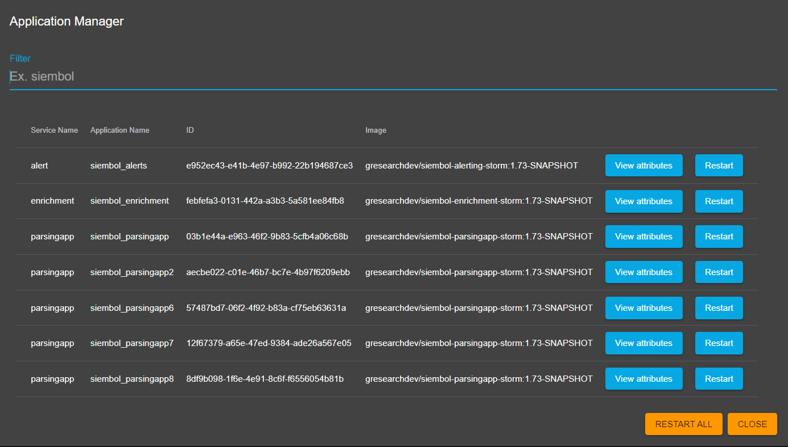
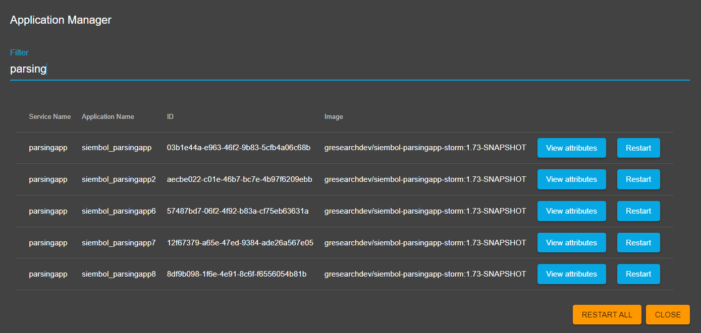

# How to manage applications
Admin users can manage applications from the actions in the [management page](./how_to_use_the_management_page.md) by clicking on the `Manage Applications` button. 

This opens up a dialog similar to the own in the screenshot below, showing the running applications for all services the user is an admin for with the application name, service name, id, image and attributes. 
A single application or all applications can be restarted from here.

If there are multiple applications it is possible to search through them using a filter, like in the screenshot below. 

> **_note:_** The `Restart All` button will always restart ALL applications even if there is a filter.

