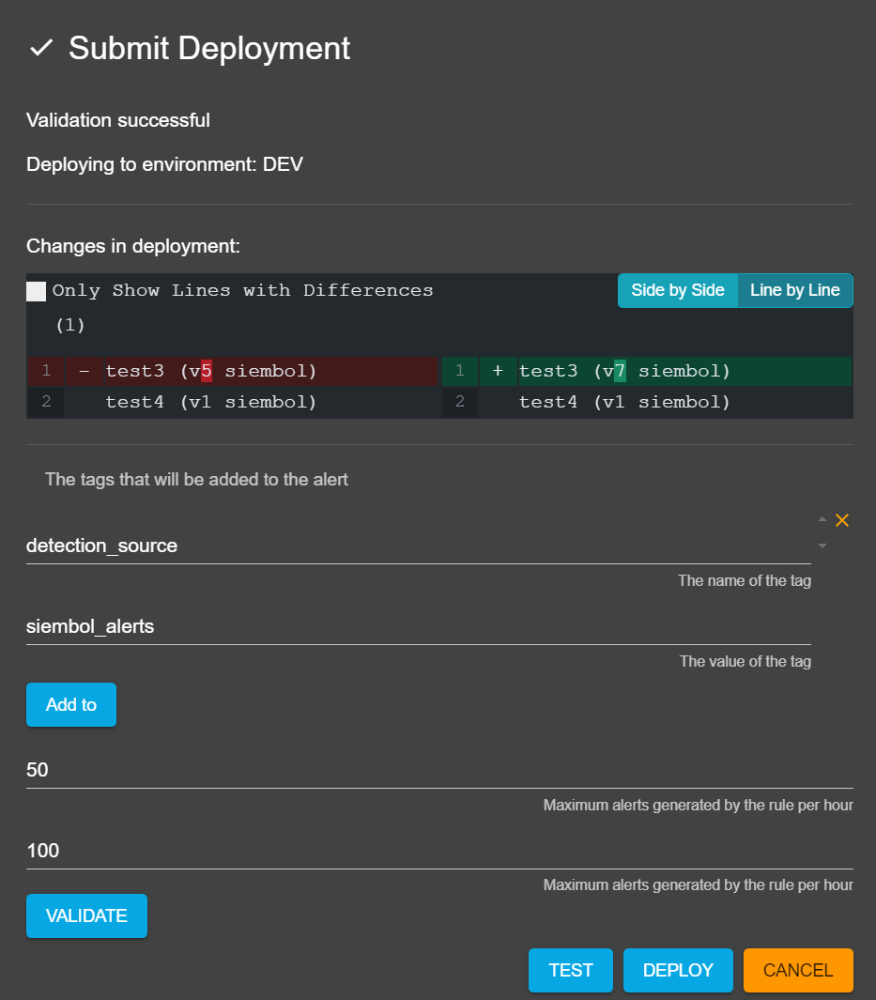
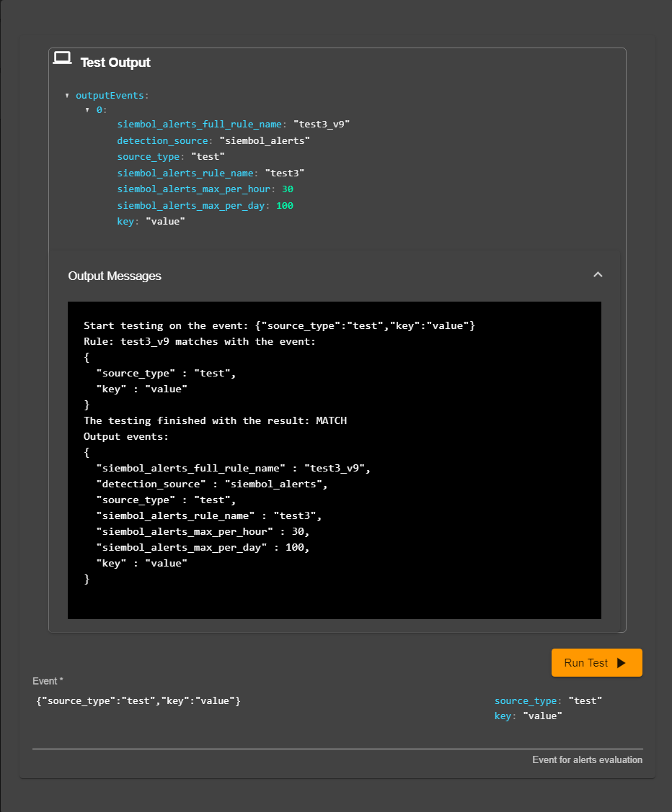

# How to test a release in siembol ui
For some services it is possible to test all the configs prior to submitting a new release from the release dialog by clicking on the `Test` button. This button will only be clickable once the release has been validated. 

This will open up a dialog that looks like the `Test Config` tab when editing a config. After filling in all required fields the "Run Test" button can be clicked and the output of the test is shown above.

The output will return two things: 
- the resulting JSON that would be outputted 
- the raw output of the test (contains more details about the testing)

