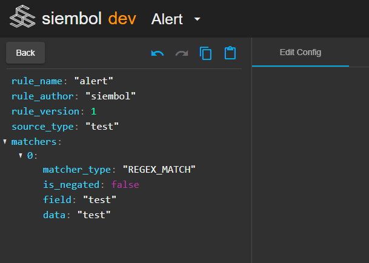

# How to use the UIs editing features
Siembol UI has copy/paste and undo/redo editing features. These are accessible via icons (as in screenshot below) during editing of a config (top left: above the JSON preview of the config), admin config or test case (top right: above the test case being edited).

Note: these features are not yet supported in response.

## Undo/Redo
Undo/Redo buttons are available during editing of a config/admin config/test case. Every time a config is submitted the history is reset. The changes applied can be seen in real time in the JSON viewer on the left of the config editor for configs and admin configs.

## Copy
Clicking on the copy icon during editing of a config will copy the JSON into your clipboard. The button is only clickable when the config is in a valid state. 

## Paste in config editor
When clicking the paste icon for the first time you should be presented with a dialog asking you to authorise this application to use your clipboard (in Chrome), you need to approve if you want to use the paste feature.

After clicking the config is validated, if it is not valid an error dialog will pop up. If it valid the config will be pasted, however the name, author and version will not be pasted.

## Paste in config manager
It is also possible to paste when creating a new config by clicking on the paste icon right of the search bar (see screenshot below). If the config in your clipboard is not valid an error dialog will pop up. If it is valid you will be redirected to a new config.

