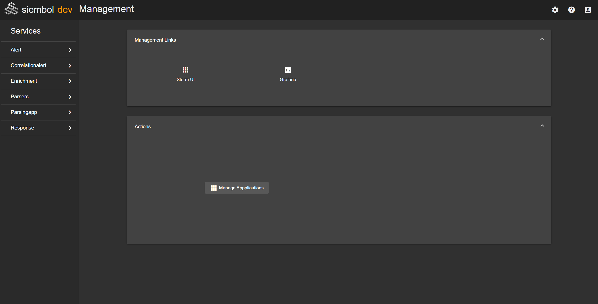

# How to use the management page

The management page can only be accessed by an admin of any service. It has two sections: one with management links and one with various actions. It can be accessed by clicking on the cog on the top right of the navigation bar.

## Links
The management links are links useful to only admins. To add management links see [here](./how_to_add_links_to_siembol_ui_home_page.md).

## Actions
Currently there is only one admin action: managing the running applications. This opens up a dialog which is explained in detail [here](./how_to_manage_applications.md).
