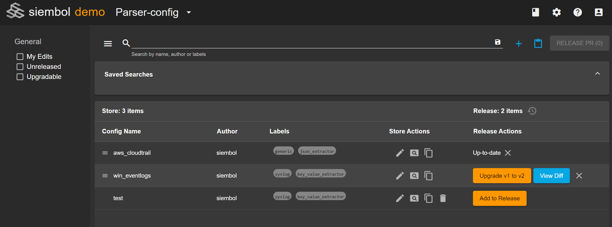
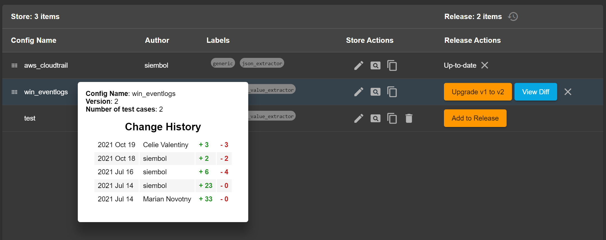

# Siembol UI
## Authentication
Two types of authentication are supported: disabled or oauth2. This can be configured in the `ui-config.json` file (more info [here](../services/how-tos/how_to_set_up_service_in_config_editor_rest.md)).
## Home page

### Services
On the home page all services are listed alphabetically by name on the left side bar. By hovering on a service you can directly access your editing of choice depending on user roles (admin or/and config) or access the various git directories used.

    

### Recently visited
Your recently visited pages are saved in your browser and can be accessed with only one click from the home page. The default number of pages shown is 5 but can be configured in the `ui-config.json` file using the "historyMaxSize" key.
 
### Explore Siembol
The 'Explore Siembol' section of the home page is for quick access to useful resources such as documentation, ticket tracking systems etc... By default there is a link to the documentation and to the issues page on the git repo. This can be customised from the `ui-config.json` config file. 

Below is the default config file provided. The two default links are in "homeLinks". To add a new one a url, an icon and a title are required like in the config below. 

    {
        "environment": "demo",
        "serviceRoot": "https://config-editor/",
        "uiBootstrapPath": "./ui-bootstrap.json",
        "authType": "disabled",
        "historyMaxSize": 5,
        "blockingTimeout": 30000,
        "homeLinks": [
            {
                "icon": "library_books",
                "title": "Documentation",
                "link": "https://github.com/G-Research/siembol/tree/main/docs"
            },
            {   
                "icon": "live_help",
                "title": "Issues",
                "link":  "https://github.com/G-Research/siembol/issues"}
            ]
    }

## Blocking timeout
The blocking timeout is a property that can be configured in `ui-config.json` (as shown in the default config above), it can be omitted in `ui-config.json`, the default value is 30 seconds. This value is used for certain operations that require blocking the entire UI (eg. deleting a config), the UI will be blocked for this maximum amount of time after which an error will occur if the operation hasn't yet finished. 

## Service configurations 
After selecting a service to edit you will be redirected to the service configuration page. An example is shown below. 

The table of configs is separated into the store (left) and release (right). To release a new config/upgrade a config it first needs to be edited in the store, then it can be added to release and peer reviewed through git PRs.

Every config in the table is in the store, to see its status in release there is the `Release Actions` column. There are three possible states:
- up-to-date: store and release have the same version
- upgradable: the version in release can be upgraded to the latest store version, click `Upgrade x to y` to upgrade
- unreleased: the config in store has not been released at all yet, click `Add to Release` to add

The configs are ordered according to the order in the release at first, followed by all the non-released ones. You can reorder configs in release by clicking and dragging the icon to the left of the config name.

To delete a config from the store it first needs to be deleted from release if it is released. To delete from release click the cross icon in the `Release Actions` column, then the bin icon should appear in the `Store Actions` column to delete from the store.

### Filtering
There is a search bar and various checkboxes on the left of the config manager used to filter the configs shown. See [here](how-tos/how_to_filter_configs_and_save_searches.md) for more details.

### History
By hovering over the `Config Name` column of a config in store its history becomes visible, see screenshot below. It includes dates, authors and the count of lines changed. 
Similarly the release history is visible by hovering over the history logo next to the release column header. 

## Creating a service config
See [here](how-tos/how_to_test_config_in_siembol_ui.md).

## Editing a service config
Editing can be done through the edit icon in the `Store Actions` column.

Once in edit mode the window is separated in two:
 - on the left is the json tree view of the config, useful for a quick view of the entire config
 - on the right the config editor separated into tabs

The config editor has three main tabs for all services (although some may be disabled):
 - Edit Config
 - Test Config
 - Test Cases

 

### Config Editor
The config editor tab is separated into different tabs that are different depending on the service. The screenshot above is for a correlation alert type service.

The submit button is disabled until the form is valid. 

### Testing Configuration
This tab can be used to test a test specification against the config in the previous tab. All that is required to run a test is a valid test specification. After clicking the `Run Test` button the output of the test is shown. More details [here](how-tos/how_to_test_config_in_siembol_ui.md).

### Test Cases
Test Cases can be set up to ensure the configuration is working as expected. It consists of test specifications and expected outputs that are stored in git. More details [here](how-tos/how_to_test_config_in_siembol_ui.md).

## Admin configuration
Admin view is similar to config editing view, the window is separated in two:
 - on the left is the json tree view of the admin config, useful for a quick view of the entire config
 - on the right the admin config editor separated into tabs

 The main difference between user config and admin config is that the latter doesn't have a store repo, only a release repo. This means that when submitting an admin config a PR is raised to the release repo directly. 
