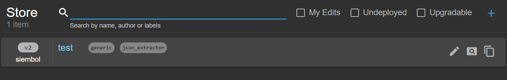
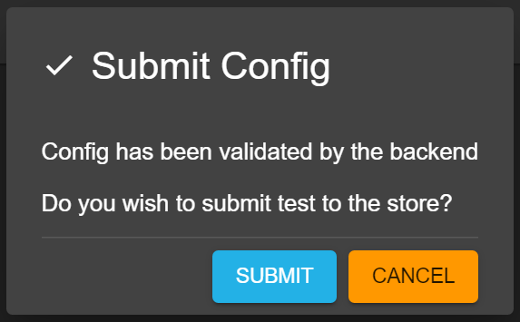

# How to add new config in siembol ui

## Add/Clone/Paste new config
There are three ways to create a new config:
- by clicking on the `plus` icon on the right of the search bar
- by cloning another config using the clone button that appears when hovering over it (as seen in screenshot above)
- by pasting another config from your clipboard by clicking on the paste icon on the right of the search bar

You will then be redirected to the Config Editor. The config name has to be unique and cannot contain any spaces. 

## Validate and Submit config to Store
Once all required fields (indicated with a `*`) are filled in the `Submit` button at the buttom right becomes clickable. Clicking it will run a validation check on the config and if it is successfull a dialog will open where you can confirm the submission (see screenshot below). If the validation is not successfull an error dialog will pop up. 

