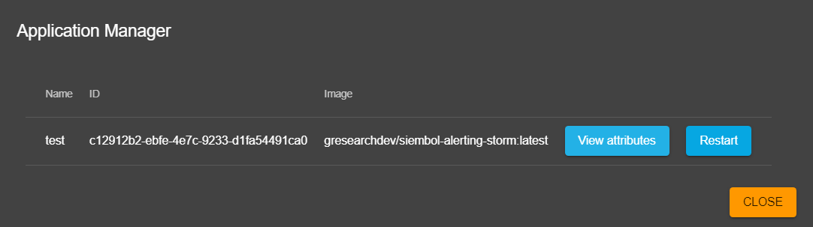
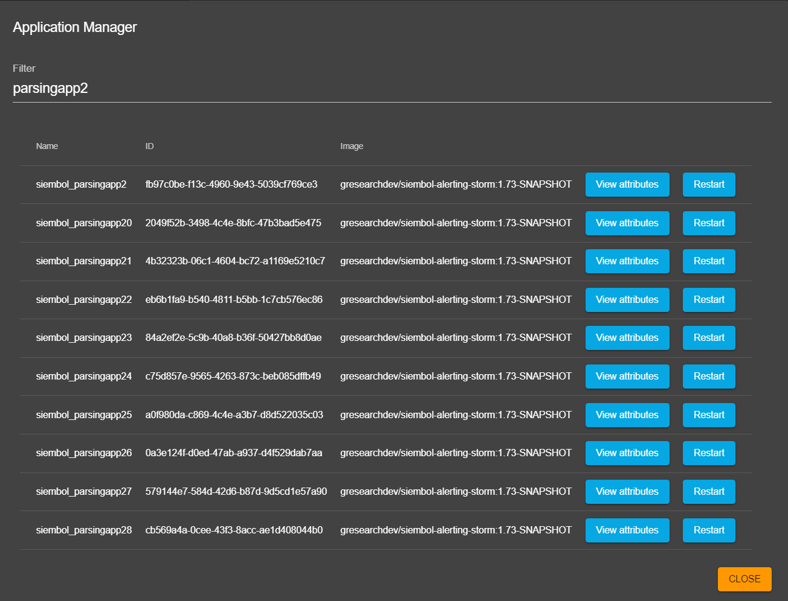

# How to manage applications
Admin users can manage applications from the admin panel by clicking on the top right `Manage Applications` button (see screenshot below). 

This opens up a dialog similar to the own in the screenshot below, showing all the running applications for the service with their name, id, image and attributes. 
Any application can also be restarted from there. 

If there are multiple applications it is possible to search through them using a filter, like in the screenshot below. 

