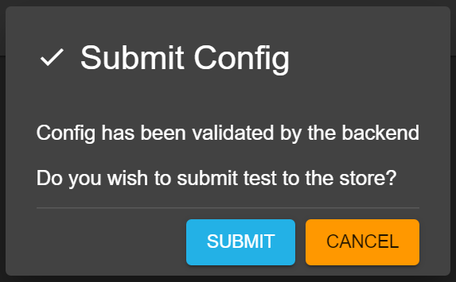

# How to submit a config in siembol ui
After the config has been edited if the form is valid the `Submit` button at the bottom right will be clickable. 

After clicking the button the new config will automatically be validated by the backend, if this is successfull a dialog will open like the one shown below. 

```
Note: the validation only checks the syntax of the config, it does not run any test cases. 
```



Once the `Submit` button in the dialog is clicked the config will be submitted to the store.

After every submission the version of the config is increased by 1 and the author is changed to the latest submitor.

If there is conflict i.e. a user tries to submit a config but does not have the latest version then they will get an error message during submission. The user will have to reload the config to get the latest version and redo their changes to be able to submit.
