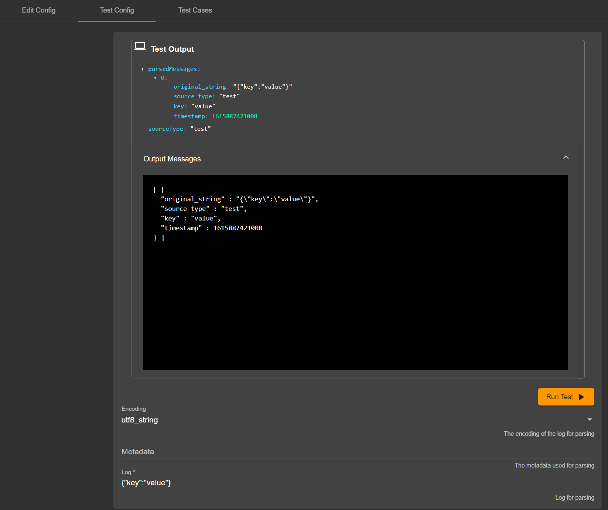
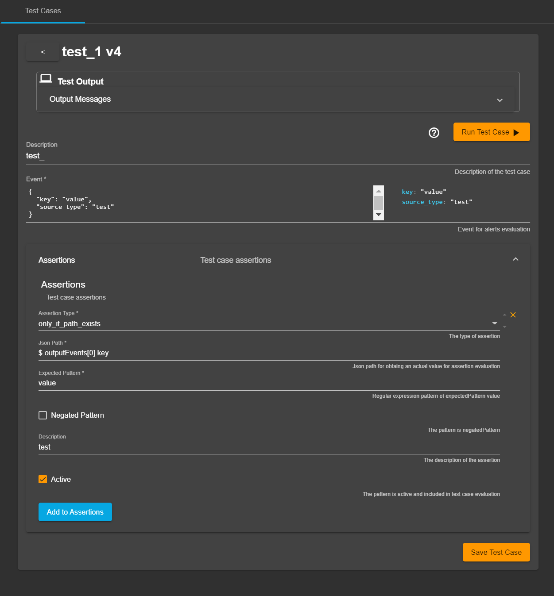
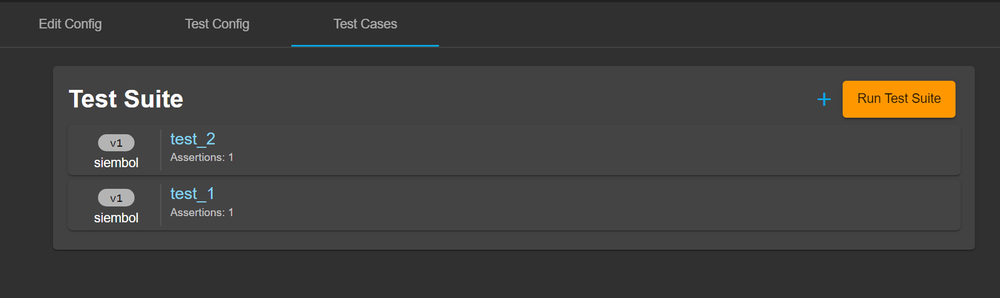
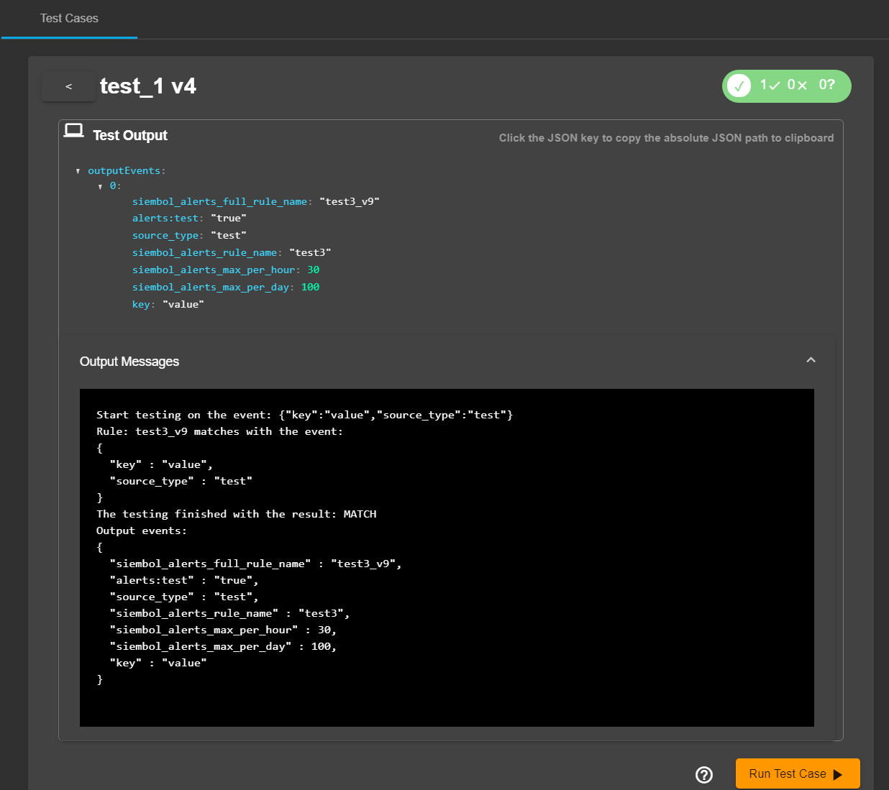
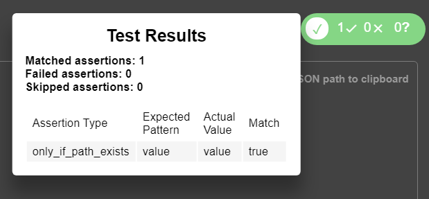
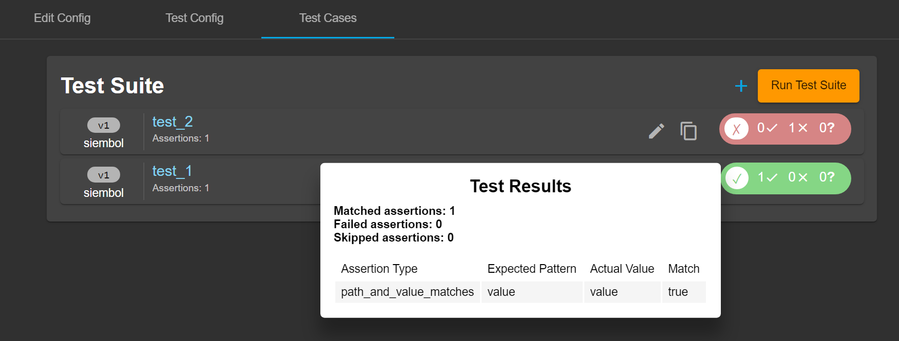

# How to test config in siembol ui
There are two ways of testing a config in the siembol UI. Either in the `Test Config` tab or the `Test Cases` tab. 

## Test Config
This tab can be used to test a test specification against the config in the previous tab. 

All testing tabs will be different based on the service. After filling in a valid test specification the "Run Test" button can be clicked and the output of the test is shown above it as can be seen in the screenshot below.  

The output will return two things: 
- the resulting JSON that would be outputted 
- the raw output of the test (contains more details about the testing)

## Test Case
In this tab you can save multiple tests for your config and make assertions on the output of the test. This can be useful when making changes to the config and you want to make sure it is behaving as expected.
### Overview
Test Cases can be set up to ensure the configuration is working as expected. It consists of test specifications and expected outputs, called assertions, that are stored in git. Below is a screenshot of a test case for the `alert` service. You need at least one assertion to be able to save the test case and you can add as many as you want.

### Add/Editing a test case
To add a new test case click on the `plus` icon on the top right. You can also clone another test by hovering over it and clicking the clone icon. To edit a test case click on the edit icon that appears when hovering over the test.

### Submit a test case
To submit a test case use the button `Save Test Case` which is clickable when the test specification and assertions are valid (you need at least on assertion). Similarly to configs the syntax of the test case will be validated on `Save Test Case` followed by the opening of a submit dialog if successfull validation. Once `Submit` is clicked the test case will be saved in git. Versioning and authors works as for configs; versions always increase by one and the author is the last submittor of the test case.

### Run and evaluate test case
To run a test case click on the `Run Test Case` button above the test case config. This will then return an output as shown below.

Similarly than for the `Test Config` tab the output will return two things: 
- the resulting JSON that would be outputted 
- the raw output of the test (contains more details about the testing)

To see if the test is successfull look at the top right of the test after having run it there will be a label giving a summary of the result. If you hover over it you can get more detailed result as seen in screenshot below.   

### Evaluate list of test cases
Once multiple test cases have been created it is possible to run them all at the same time by clicking on the `Run Test Suite` button. On the right of each test case will be a box indicating whether it was successfull. You can hover over it to get more details. 

